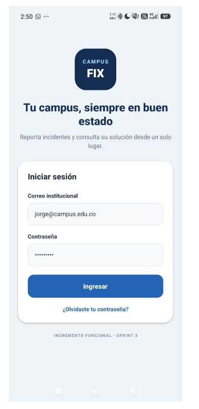
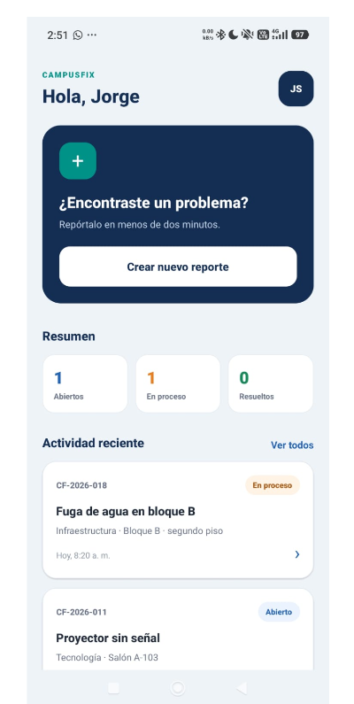
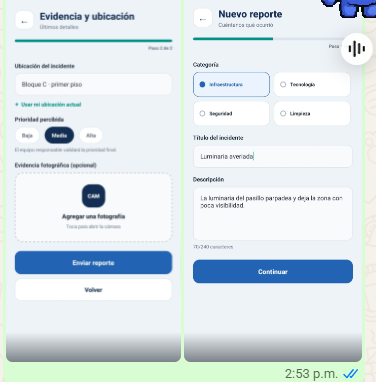
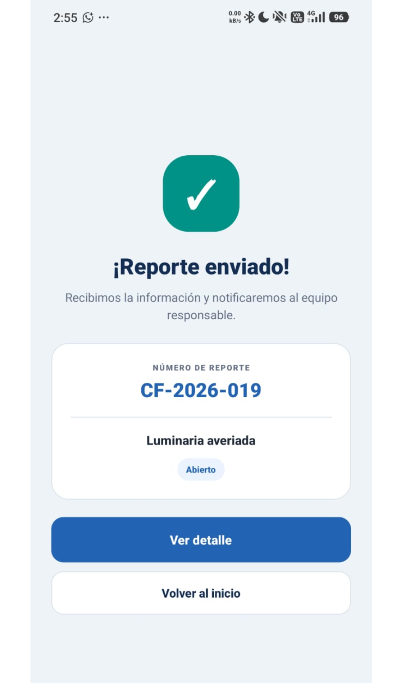
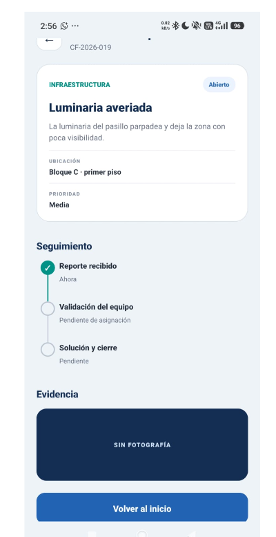

# Evidencias del Sprint 3

**Actividad:** Esqueleto móvil y navegación básica  
**Programa:** Ingeniería Mecatrónica  
**Plataforma probada:** dispositivo Android físico  
**Paquete Android:** `com.campusfix.mecatronica`

## Entregables

- Código fuente: Pull Request [#17](https://github.com/campusfix-mecatronica-2026/CampusFix/pull/17).
- APK de distribución interna: [compilación exitosa en Expo EAS](https://expo.dev/accounts/campusfix-mecatronica-2026/projects/campusfix/builds/1b334e00-e097-4598-a3ca-583ae618174d).
- Perfil de compilación: `preview` con artefacto Android `apk`.
- Integridad del APK (SHA-256): `22C2F71C147FE189A2B518372EA9377908D0BBEFFB267B11601DF49D37FA3B72`.

## Flujo validado

1. Instalación y apertura del APK.
2. Inicio de sesión.
3. Navegación a la pantalla principal.
4. Creación de un nuevo reporte.
5. Registro de ubicación, prioridad y evidencia opcional.
6. Envío y generación del reporte `CF-2026-019`.
7. Consulta del detalle y seguimiento del reporte.

## Capturas

### Aplicación instalada

### Navegación al inicio

### Formulario y ubicación

### Reporte enviado

### Detalle y seguimiento

